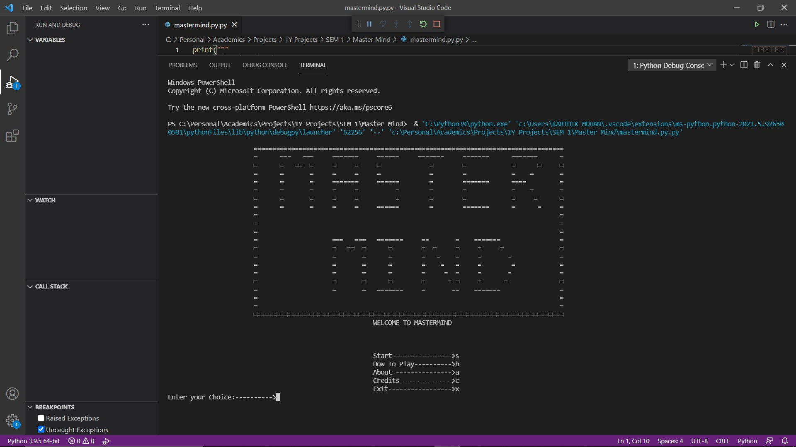
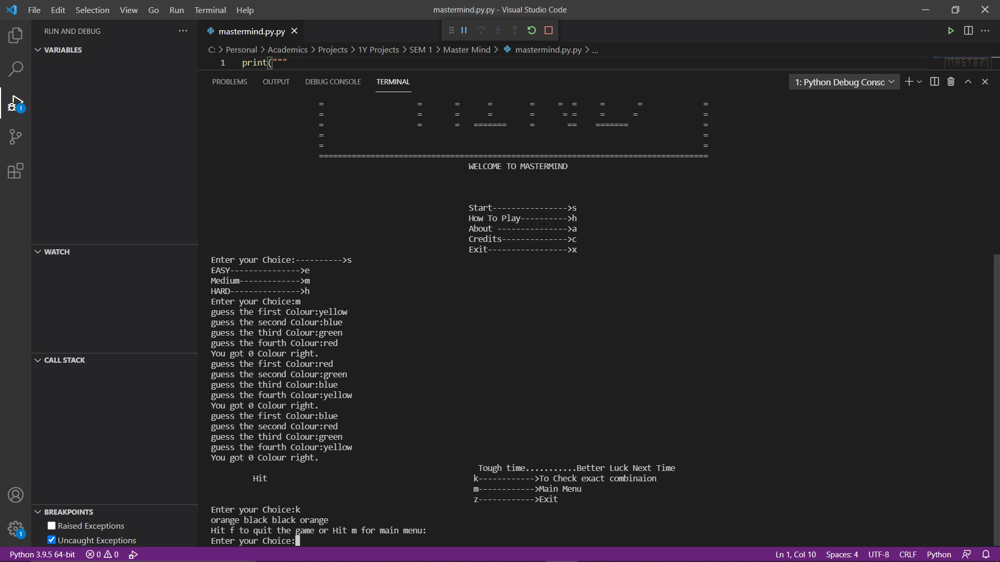

# 🎮 Mastermind Bot Game

Welcome to the **Mastermind Bot Game** — a text-based Python implementation of the classic Mastermind color-guessing game! This project offers an engaging command-line experience, with interactive feedback and customizable difficulty levels.

---

## 🧠 Game Concept

Mastermind is a logic-based guessing game. The player must guess a sequence of four colors (e.g., Red, Blue, Green, Yellow) within a limited number of attempts. After each guess, feedback is given:

- ✅ Number of colors guessed correctly in the correct position.
- 🎯 Number of correct colors guessed but in the wrong position.

---

## 🕹️ Features

- 🎚️ **Difficulty Levels**: 
  - *Easy*: 12 attempts  
  - *Medium*: 8 attempts  
  - *Hard*: 5 attempts

- 🧩 **Feedback System**: Real-time hints on each guess.

- 📜 **Menu Options**:
  - Start Game
  - View Game Rules
  - View Credits
  - Exit

- 🐍 Developed in Python using basic control structures, functions, and conditional logic.

---

## 📸 Screenshots

### Interface:


### Game Output:


---

## 🚀 How to Run

Make sure you have Python installed (Python 3.6+ recommended).

```bash
git clone https://github.com/Vasanthmane/mastermind-bot-game.git
cd mastermind-bot-game
python main.py
